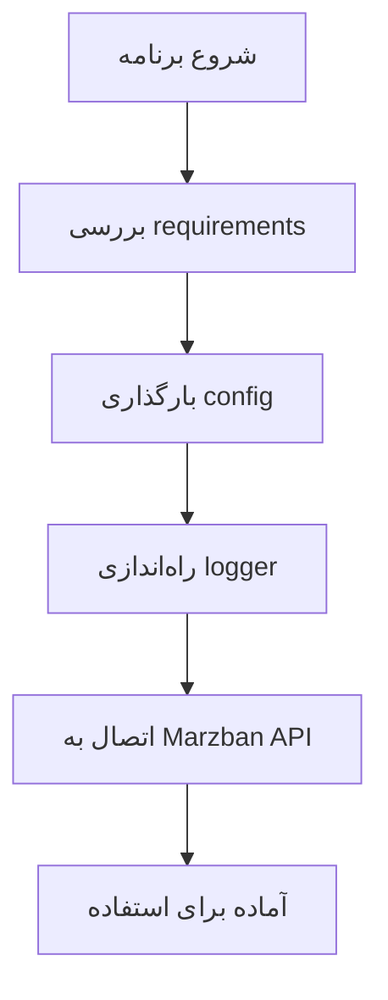
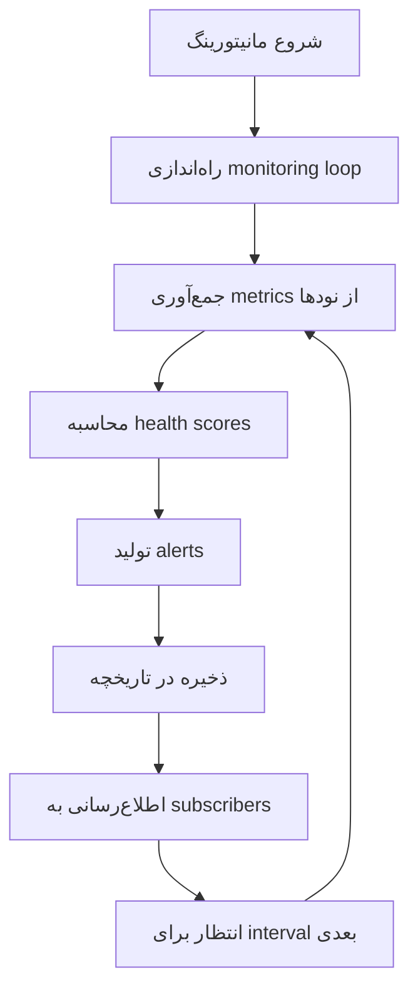
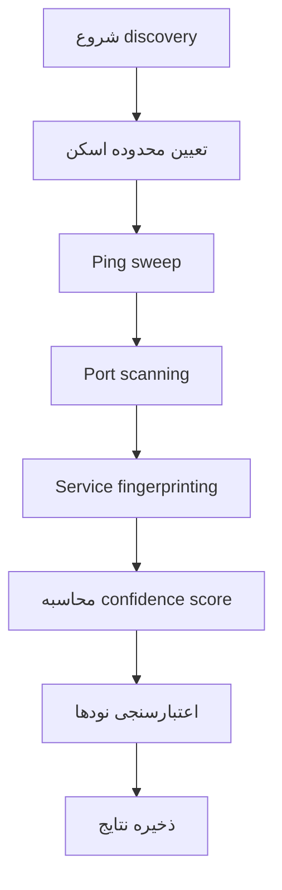

# 🏗️ Marzban Central Manager - Architecture Guide

## 📖 راهنمای کامل معماری و ساختار پروژه

این راهنمای جامع برای درک کامل ساختار، معماری، و نحوه کارکرد Marzban Central Manager v4.0 طراحی شده است.

---

## 🎯 هدف کلی پروژه

**Marzban Central Manager** یک سیستم مدیریت متمرکز و حرفه‌ای برای پنل‌های Marzban است که امکانات زیر را فراهم می‌کند:

- 🔧 **مدیریت نودها**: اضافه، حذف، و مدیریت کامل نودهای Marzban
- 📊 **مانیتورینگ Real-time**: نظارت زنده بر وضعیت و عملکرد نودها
- 🔍 **کشف خودکار**: پیدا کردن خودکار نودهای Marzban در شبکه
- 🎛️ **رابط کاربری چندگانه**: CLI، Interactive Menu، و API

---

## 📁 ساختار کلی پروژه

```
MarzbanCentralManager/
├── 📄 main.py                    # نقطه ورود اصلی CLI
├── 📄 marzban_manager.py         # نقطه ورود Interactive Mode
├── 📄 requirements.txt           # وابستگی‌های Python
├── 📄 install.sh                 # اسکریپت نصب خودکار
├── 📄 README.md                  # مستندات اصلی
├── 📄 CHANGELOG.md               # تاریخچه تغییرات
├── 📄 ARCHITECTURE.md            # این فایل - راهنمای معماری
│
├── 📂 src/                       # کد اصلی برنامه
│   ├── 📂 core/                  # هسته اصلی سیستم
│   ├── 📂 api/                   # لایه ارتباط با API
│   ├── 📂 models/                # مدل‌های داده
│   ├── 📂 services/              # منطق کسب و کار
│   └── 📂 cli/                   # رابط خط فرمان
│
├── 📂 config/                    # فایل‌های پیکربندی
├── 📂 tests/                     # تست‌های خودکار
└── 📂 docs/                      # مستندات تکمیلی
```

---

## 🧠 معماری کلی سیستم

### 🔄 جریان کلی داده‌ها

```
👤 کاربر
    ↓
🖥️ CLI / Interactive Menu
    ↓
🔧 Services Layer (منطق کسب و کار)
    ↓
🌐 API Layer (ارتب��ط با Marzban)
    ↓
📊 Core Layer (مدیریت اتصال، کش، لاگ)
    ↓
🎯 Marzban Panel API
```

### 🏛️ لایه‌های معماری

1. **🎨 Presentation Layer**: CLI و Interactive Menu
2. **🔧 Business Logic Layer**: Services
3. **🌐 API Layer**: ارتباط با Marzban API
4. **📊 Core Layer**: مدیریت اتصال، کش، امنیت
5. **💾 Data Layer**: مدل‌های داده

---

## 📂 توضیح دقیق هر بخش

### 🏠 فایل‌های اصلی (Root Directory)

#### 📄 `main.py` - نقطه ورود CLI
```python
# وظایف:
- نقطه ورود اصلی برای استفاده از CLI
- مدیریت command groups (node, monitor, discover, config)
- پیکربندی logger و config
- مدیریت context و error handling

# نحوه استفاده:
python main.py node list
python main.py monitor start
python main.py discover network
```

#### 📄 `marzban_manager.py` - نقطه ورود Interactive
```python
# وظایف:
- نقطه ورود برای حالت تعاملی (Interactive Mode)
- بررسی وابستگی‌ها (requirements check)
- نمایش banner و راهنمای سریع
- راه‌اندازی منوی تعاملی

# نحوه استفاده:
python marzban_manager.py
```

#### 📄 `requirements.txt` - وابستگی‌ها
```
# کتابخانه‌های اصلی:
httpx>=0.25.0          # HTTP client async
click>=8.1.0           # CLI framework
pyyaml>=6.0           # YAML parser
tabulate>=0.9.0       # Table formatting
psutil>=5.9.0         # System monitoring
netifaces>=0.11.0     # Network discovery
cryptography>=41.0.0  # Security
```

---

### 📂 `src/core/` - هسته اصلی سیستم

این بخش شامل اجزای اساسی و زیرساختی سیستم است.

#### 📄 `config.py` - مدیریت پیکربندی
```python
# وظایف:
- مدیریت تنظیمات اصلی سیستم
- ذخیره و بارگذاری config از فایل YAML
- مدیریت اطلاعات اتصال به Marzban
- تنظیمات مانیتورینگ و discovery

# کلاس‌های اصلی:
- AppConfig: تنظیمات کلی
- MarzbanConfig: تنظیمات اتصال به Marzban
- ConfigManager: مدیریت config
```

#### 📄 `logger.py` - سیستم لاگ
```python
# وظایف:
- مدیریت لاگ‌های سیستم
- پشتیبانی از سطوح مختلف لاگ (DEBUG, INFO, WARNING, ERROR)
- ذخیره لاگ در فایل و نمایش در کنسول
- فرمت‌بندی حرفه‌ای لاگ‌ها

# ویژگی‌ها:
- Structured logging
- Rotation برای فایل‌های لاگ
- Color coding برای کنسول
```

#### 📄 `connection_manager.py` - مدیریت اتصالات
```python
# وظایف:
- مدیریت connection pool برای HTTP requests
- پیاده‌سازی Circuit Breaker pattern
- Retry logic با exponential backoff
- مدیریت timeout و error handling

# ویژگی‌های پیشرفته:
- Connection pooling برای بهبود عملکرد
- Circuit breaker برای fault tolerance
- Automatic retry با jitter
- Health monitoring اتصالات
```

#### 📄 `token_manager.py` - مدیریت توکن‌ها
```python
# وظایف:
- مدیریت JWT tokens
- Auto-refresh توکن‌های منقضی شده
- ذخیره امن توکن‌ها
- مدیریت session‌های متعدد

# امکانات:
- Automatic token refresh
- Secure token storage
- Multi-service token management
- Expiry tracking
```

#### 📄 `cache_manager.py` - مدیریت کش
```python
# وظایف:
- کش کردن نتایج API calls
- مدیریت TTL (Time To Live)
- Cache invalidation هوشمند
- بهبود عملکرد سیستم

# ویژگی‌ها:
- In-memory caching
- TTL-based expiration
- Tag-based invalidation
- Statistics tracking
```

#### 📄 `network_validator.py` - اعتبارسنجی شبکه
```python
# وظایف:
- تست اتصال به سرورها
- اعتبارسنجی IP addresses و ports
- تست ping و connectivity
- اعتبارسنجی HTTP responses

# متدهای اصلی:
- test_ping(): تست ping
- test_connectivity(): تست اتصال TCP
- test_http_response(): تست HTTP
- validate_ssl_certificate(): اعتبارسنجی SSL
```

#### 📄 `exceptions.py` - مدیریت خطاها
```python
# وظایف:
- تعریف exception های سفارشی
- مدیریت انواع خطاهای API
- Error handling منظم
- پیام‌های خطای کاربرپسند

# Exception های اصلی:
- APIError: خطاهای عمومی API
- AuthenticationError: خطاهای احراز هویت
- ConnectionError: خطاهای اتصال
- ValidationError: خطاهای اعتبارسنجی
```

#### 📄 `utils.py` - توابع کمکی
```python
# وظایف:
- توابع کمکی عمومی
- اعتبارسنجی IP، domain، URL
- فرمت‌بندی bytes، duration
- توابع امنیتی و validation

# توابع مهم:
- is_valid_ip(): اعتبارسنجی IP
- format_bytes(): فرمت bytes
- format_duration(): فرمت زمان
- mask_sensitive_data(): مخفی کردن داده‌های حساس
```

---

### 📂 `src/api/` - لایه ارتباط با API

#### 📄 `base.py` - کلاینت پایه API
```python
# وظایف:
- کلاینت پایه برای ارتباط با Marzban API
- مدیریت authentication
- Handle کردن HTTP requests/responses
- Error handling و retry logic

# ویژگی‌های کلیدی:
- Async context manager
- Automatic authentication
- Response handling
- Connection management integration
```

#### 📂 `endpoints/` - نقاط پایانی API

##### 📄 `nodes.py` - API مدیریت نودها
```python
# وظایف:
- CRUD operations برای نودها
- مدیریت وضعیت نودها
- دریافت آمار و metrics
- مدیریت تنظیمات نودها

# متدهای اصلی:
- list_nodes(): لیست نودها
- create_node(): ایجاد نود جدید
- update_node(): به‌روزرسانی نود
- delete_node(): حذف نود
- get_node_stats(): آمار نود
```

---

### 📂 `src/models/` - مدل‌های داده

#### 📄 `node.py` - مدل نود
```python
# وظایف:
- تعریف ساختار داده نود
- مدیریت وضعیت‌های مختلف نود
- Serialization/Deserialization
- Validation داده‌ها�� نود

# کلاس‌های اصلی:
- Node: مدل اصلی نود
- NodeStatus: enum وضعیت‌های نود
- NodeCreateRequest: درخواست ایجاد نود
- NodeUpdateRequest: درخواست به‌روزرسانی
```

#### 📄 `user.py` - مدل کاربر
```python
# وظایف:
- مدل داده‌های کاربر
- مدیریت اطلاعات کاربری
- Validation اطلاعات کاربر

# (آماده برای توسعه آینده)
```

#### 📄 `response.py` - مدل‌های پاسخ
```python
# وظایف:
- مدل‌های استاندارد برای پاسخ‌های API
- مدیریت error responses
- Pagination models
- Status response models
```

---

### 📂 `src/services/` - منطق کسب و کار

این بخش شامل منطق اصلی کسب و کار و عملیات‌های پیچیده سیستم است.

#### 📄 `node_service.py` - سرویس مدیریت نودها
```python
# وظایف:
- منطق کسب و کار مدیریت نودها
- عملیات CRUD با validation
- مدیریت وضعیت و health check
- آمارگیری و reporting

# متدهای کلیدی:
- create_node(): ایجاد نود با validation
- update_node(): به‌روزرسانی امن
- get_healthy_nodes(): نودهای سالم
- get_node_usage(): آمار ا��تفاده
- wait_for_connection(): انتظار برای اتصال
```

#### 📄 `monitoring_service.py` - سرویس مانیتورینگ
```python
# وظایف:
- مانیتورینگ real-time نودها
- جمع‌آوری metrics و آمار
- مدیریت alerts و notifications
- ذخیره تاریخچه عملکرد

# ویژگی‌های اصلی:
- Real-time monitoring loop
- Health scoring algorithm
- Alert generation
- Historical data storage
- Subscriber pattern برای updates

# کلاس‌های مهم:
- MonitoringService: سرویس اصلی
- NodeMetrics: metrics هر نود
- SystemMetrics: metrics کل سیستم
- HealthStatus: enum وضعیت سلامت
```

#### 📄 `discovery_service.py` - سرویس کشف خودکار
```python
# وظایف:
- کشف خودکار نودهای Marzban در شبکه
- اسکن شبکه با روش‌های مختلف
- تشخیص هوشمند سرویس‌های Marzban
- اعتبارسنجی نودهای کشف شده

# روش‌های کشف:
- Ping sweep: اسکن با ping
- Port scanning: اسکن پورت‌ها
- Service fingerprinting: تشخیص سرویس
- Deep scanning: تحلیل عمیق

# کلاس‌های مهم:
- DiscoveryService: سرویس اصلی
- DiscoveredNode: نود کشف شده
- DiscoveryConfig: تنظیمات کشف
- DiscoveryMethod: enum روش‌های کشف
```

#### 📄 `bulk_operations_service.py` - عملیات گروهی
```python
# وظایف:
- عملیات روی چندین نود همزمان
- Batch processing
- Progress tracking
- Error handling برای عملیات گروهی

# عملیات پشتیبانی شده:
- Bulk node updates
- Mass configuration changes
- Batch health checks
- Group operations
```

#### 📄 `node_validator_service.py` - اعتبارسنجی نودها
```python
# وظایف:
- اعتبارسنجی جامع نودها
- Health check های پیشرفته
- تولید recommendations
- Scoring نودها

# انواع validation:
- Connectivity validation
- Service validation
- Performance validation
- Security validation
```

---

### 📂 `src/cli/` - رابط خط فرمان

#### 📂 `commands/` - دستورات CLI

##### 📄 `node.py` - دستورات مدیریت نود
```python
# دستورات موجود:
- node list: لیست نودها
- node show <id>: نمایش جزئیات نود
- node add: اضافه کردن نود جدید
- node update <id>: به‌روزرسانی نود
- node delete <id>: حذف نود
- node status: خلاصه وضعیت
- node healthy: نودهای سالم
- node unhealthy: نودهای ناسالم

# مثال استفاده:
python main.py node list
python main.py node add --name "Node1" --address "192.168.1.100"
```

##### 📄 `monitor.py` - دستورات مانیتورینگ
```python
# دستورات موجود:
- monitor start: شروع مانیتورینگ real-time
- monitor status: وضعیت فعلی مانیتورینگ
- monitor stop: توقف مانیتورینگ
- monitor alerts: نمایش هشدارها
- monitor summary: خلاصه سلامت سیستم
- monitor history <node_id>: تاریخچه نود
- monitor force-update: به‌روزرسانی اجباری

# مثال استفاده:
python main.py monitor start --interval 30
python main.py monitor alerts
```

##### 📄 `discover.py` - دستورات کشف خودکار
```python
# دستورات موجود:
- discover network: کشف شبکه محلی
- discover range <start> <end>: کشف محدوده IP
- discover list: لیست نودهای کشف شده
- discover candidates: کاندیدهای Marzban
- discover validate <ip>: اعتبارسنجی IP
- discover add <ip>: اضافه کردن نود کشف شده
- discover clear: پاک کردن کش
- discover stop: توقف کشف

# مثال استفاده:
python main.py discover network --deep-scan
python main.py discover range 192.168.1.1 192.168.1.100
```

#### 📂 `ui/` - رابط کاربری

##### 📄 `menus.py` - منوی تعاملی
```python
# وظایف:
- منوی تعاملی کامل
- ناوبری بین بخش‌های مختلف
- اجرای عملیات از طریق منو
- نمایش real-time اطلاعات

# منوهای اصلی:
1. Node Management: مدیریت نودها
2. Live Monitoring: مانیتورینگ زنده
3. Auto Discovery: کشف خودکار
4. Configuration: تنظیمات
5. System Status: وضعیت سیستم

# ویژگی‌ها:
- User-friendly navigation
- Real-time updates
- Error handling
- Progress indicators
```

##### 📄 `display.py` - توابع نمایش
```python
# وظایف:
- توابع نمایش داده‌ها
- فرمت‌بندی جداول
- نمایش پیام‌های رنگی
- Progress bars

# توابع اصلی:
- display_nodes_table(): جدول نودها
- display_status_summary(): خلاصه وضعیت
- success_message(): پیام موفقیت
- error_message(): پیام خطا
```

---

## 🔄 جریان کار (Workflow) سیستم

### 🚀 راه‌اندازی اولیه



### 📊 جریان مانیتورینگ



### 🔍 جریان کشف خودکار



---

## 🔗 ارتباطات بین اجزا

### 📊 نمودار وابستگی‌ها

```
CLI Commands
    ↓
Services Layer
    ↓
API Layer ←→ Core Layer
    ↓           ↓
Marzban API   Cache/Log/Config
```

### 🔄 الگوهای طراحی استفاده شده

1. **Repository Pattern**: در Services برای جداسازی منطق کسب و کار
2. **Factory Pattern**: در API clients برای ایجاد اتصالات
3. **Observer Pattern**: در Monitoring برای اطلاع‌رسانی
4. **Circuit Breaker Pattern**: در Connection Manager برای fault tolerance
5. **Singleton Pattern**: در Config Manager و Logger

---

## 🛠️ نحوه توسعه و اضافه کردن فیچر جدید

### 1. اضافه کردن Service جدید

```python
# 1. ایجاد فایل در src/services/
class NewService:
    def __init__(self):
        self.logger = get_logger("new_service")
    
    async def new_operation(self):
        # منطق کسب و کار
        pass

# 2. اضافه کردن به CLI
@click.command()
async def new_command():
    service = NewService()
    await service.new_operation()

# 3. اضافه کردن به Interactive Menu
async def _new_menu_action(self):
    # پیاده‌سازی عملیات در منو
    pass
```

### 2. اضافه کردن API Endpoint جدید

```python
# در src/api/endpoints/
class NewEndpoint(BaseAPIClient):
    async def new_api_call(self):
        return await self.get("new-endpoint")
```

### 3. اضافه کردن Model جدید

```python
# در src/models/
@dataclass
class NewModel:
    field1: str
    field2: int
    
    @classmethod
    def from_dict(cls, data: dict):
        return cls(**data)
```

---

## 🔧 تنظیمات و پیکربندی

### 📄 فایل config اصلی

```yaml
# config/settings.yaml
marzban:
  base_url: "https://panel.example.com:8000"
  username: "admin"
  password: "password"
  timeout: 30
  verify_ssl: true

monitoring:
  interval: 30
  history_size: 100
  alert_thresholds:
    response_time: 1000
    health_percentage: 80

discovery:
  timeout: 5
  max_concurrent: 50
  target_ports: [62050, 62051, 22, 80, 443]

logging:
  level: "INFO"
  file: "logs/marzban_manager.log"
  max_size: "10MB"
  backup_count: 5
```

---

## 🐛 عیب‌یابی و مشکلات رایج

### 1. مشکلات اتصال
```bash
# بررسی اتصال
python main.py config test

# نمایش لاگ‌ها
tail -f logs/marzban_manager.log
```

### 2. مشکلات Discovery
```bash
# تست با deep scan
python main.py discover network --deep-scan

# بررسی IP خاص
python main.py discover validate 192.168.1.100
```

### 3. مشکلات Monitoring
```bash
# بررسی وضعیت
python main.py monitor status

# به‌روزرسانی اجباری
python main.py monitor force-update
```

---

## 📈 آمار و Metrics

### 📊 انواع Metrics جمع‌آوری شده

1. **Node Metrics**:
   - Response time
   - Health status
   - Connection status
   - Last seen timestamp

2. **System Metrics**:
   - Total nodes
   - Healthy/Warning/Critical counts
   - Overall health percentage
   - Alert counts

3. **Discovery Metrics**:
   - Discovered nodes count
   - Confidence scores
   - Scan duration
   - Success rates

---

## 🔒 امنیت

### 🛡️ اقدامات امنیتی

1. **Token Management**: ذخیره امن و auto-refresh
2. **Input Validation**: اعتبارسنجی کامل ورودی‌ها
3. **SSL/TLS**: رمزنگاری ارتباطات
4. **Error Handling**: عدم افشای اطلاعات حساس
5. **Logging**: لاگ امن بدون اطلاعات حساس

---

## 🚀 نکات عملکرد

### ⚡ بهینه‌سازی‌های انجام شده

1. **Connection Pooling**: استفاده مجدد از اتصالات
2. **Async Operations**: عملیات غیرهمزمان
3. **Caching**: کش کردن نتایج API
4. **Circuit Breaker**: جلوگیری از اتصالات ناموفق
5. **Concurrent Scanning**: اسکن موازی در Discovery

---

## 📚 منابع و مراجع

### 🔗 لینک‌های مفید

- [Marzban Documentation](https://github.com/Gozargah/Marzban)
- [httpx Documentation](https://www.python-httpx.org/)
- [Click Documentation](https://click.palletsprojects.com/)
- [asyncio Documentation](https://docs.python.org/3/library/asyncio.html)

### 📖 مطالعه بیشتر

- **Design Patterns**: Repository, Factory, Observer
- **Async Programming**: asyncio, aiohttp
- **API Design**: REST, Error Handling
- **Network Programming**: Socket, TCP/IP

---

## 🎯 خلاصه

**Marzban Central Manager** یک سیستم مدیریت پیچیده و حرفه‌ای است که با معماری لایه‌ای و استفاده از الگوهای طراحی مدرن، امکانات جامعی برای مدیریت نودهای Marzban فراهم می‌کند.

### ✨ نقاط قوت معماری:

- **Modularity**: جداسازی واضح مسئولیت‌ها
- **Scalability**: قابلیت توسعه آسان
- **Maintainability**: نگهداری و به‌روزرسانی ساده
- **Testability**: قابلیت تست بالا
- **Performance**: عملکرد بهینه با async operations
- **Reliability**: مقاوم در برابر خطا با Circuit Breaker

این معماری امکان توسعه آسان فیچرهای جدید و نگهداری طولانی‌مدت پروژه را فراهم می‌کند.

---

**📝 نوشته شده برای تیم توسعه و کاربران پیشرفته Marzban Central Manager**